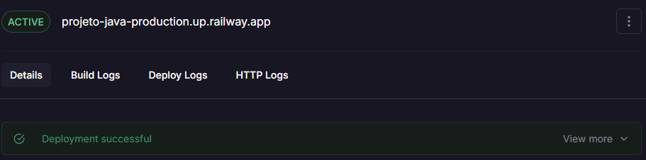
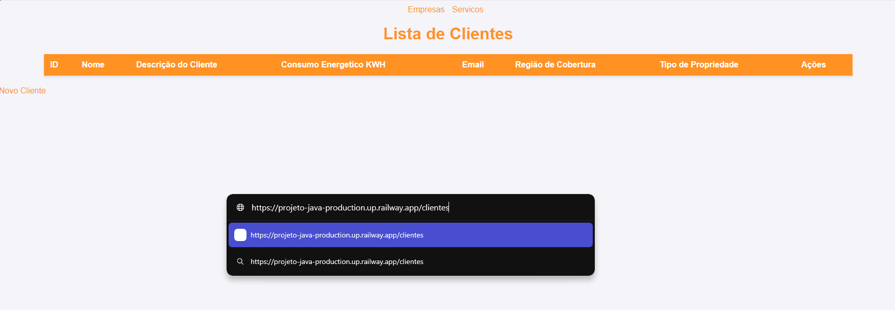

# SolarSync

<h1 id="autores">🤝 Integrantes</h2>
<table>
  <tr>
    <td align="center">
      <p>Mobile</p>
      <a href="https://github.com/nichol6s">
        <br>
        <sub>
          <strong>Nicholas Santos</strong>
        </sub>
      </a>
    </td>
    <td align="center">
      <p>IA</p>
      <a href="https://github.com/VitorKubica">
        <br>
        <sub>
          <strong>Vitor Kubica</strong>
        </sub>
      </a>
    </td>
    <td align="center">
      <p>Database & C#</p>
      <a href="https://github.com/DuduViolante">
        <br>
        <sub>
          <strong>Eduardo Violante</strong>
        </sub>
      </a>
    </td>
    <td align="center">
      <p>Java</p>
      <a href="https://github.com/pedrocpacheco">
        <br>
        <sub>
          <strong>Pedro</strong>
        </sub>
      </a>
    </td>
    <td align="center">
        <p>DevOps & Compliance</p>
        <a href="https://github.com/biasvestka">
        <br>
        <sub>
            <strong>Beatriz Svestka</strong>
        </sub>
      </a>
    </td>
  </tr>
</table>

## 🚀 Iniciando o projeto
```sh
#Clone o repositorio
$ git clone https://github.com/pedrocpacheco/SolarSync_GS_Java

#Clique com o botão direito na classe ApiAnallyzerApplication
#Run as -> Java Application
```
### 🎥 Vídeo Pitch
https://youtu.be/od8EunHgmUY

### 🎥 Vídeo Explicativo Projeto Java
https://youtu.be/L-YYX8WWB8I

## Links LocalHost 🏠:
---

### Acessar páginas HTML 📄:

#### Página HTML de Clientes 🧑‍💼:
http://localhost:8080/clientes

#### Páginas HTML de Empresas 🏢:
http://localhost:8080/empresas

#### Página HTML de Serviços 🤝:
http://localhost:8080/servicos

---

### Acessar Endpoints API 🧩:

#### Endpoint da API de Clientes 🧑‍💼:
http://localhost:8080/api/clientes

#### Endpoint da API de Empresas 🏢:
http://localhost:8080/api/empresas

#### Endpoint da API de Serviços 🤝:
http://localhost:8080/api/servicos


## Links Deploy 🌐:
---

### Acessar páginas HTML 📄:

#### Página HTML de Clientes 🧑‍💼: 
https://projeto-java-production.up.railway.app/clientes

#### Páginas HTML de Empresas 🏢:
https://projeto-java-production.up.railway.app/empresas

#### Página HTML de Serviços 🤝:
https://projeto-java-production.up.railway.app/servicos

---

### Acessar Endpoints API 🧩:

#### Endpoint da API de Clientes 🧑‍💼:
https://projeto-java-production.up.railway.app/api/clientes

#### Endpoint da API de Empresas 🏢:
https://projeto-java-production.up.railway.app/api/empresas

#### Endpoint da API de Serviços 🤝:
https://projeto-java-production.up.railway.app/api/servicos


## Explicação

Devido a plano de testes do Railway, e instabilidade da plataforma é capaz que o Deploy não esteja disponível na hora da avaliação. Normalmente o mesmo é reiniciado após inatividade, por isso também existem os endpoints via localhost.




